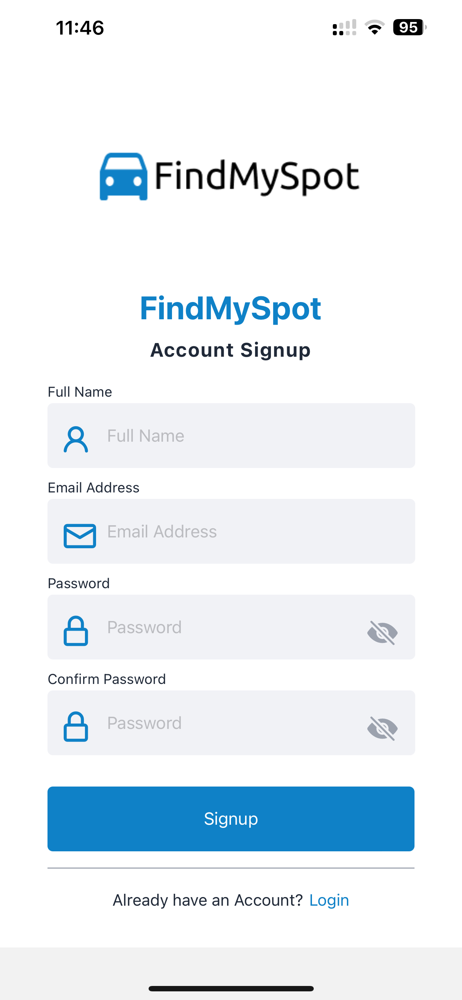
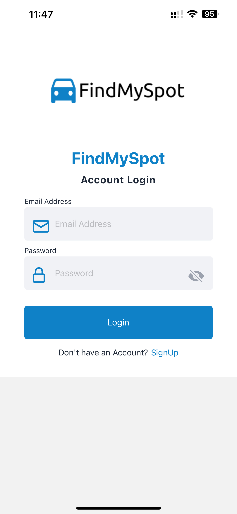
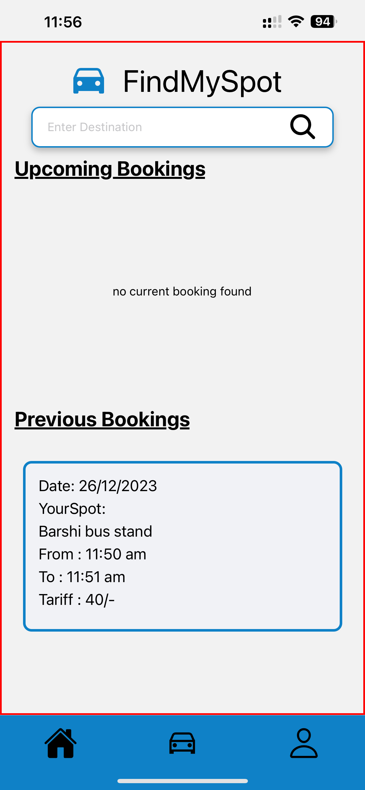
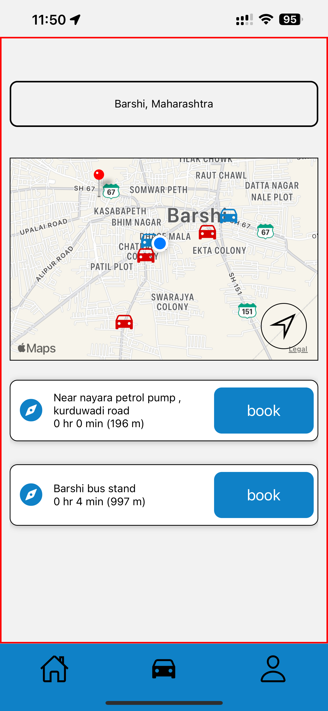
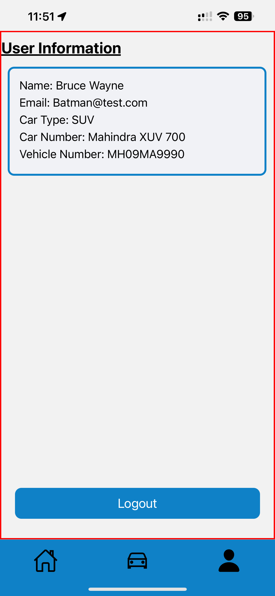
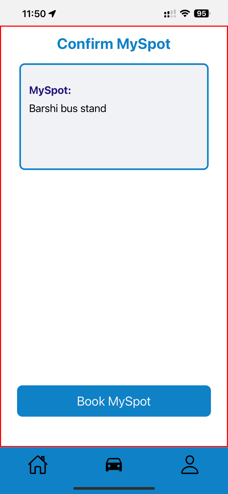
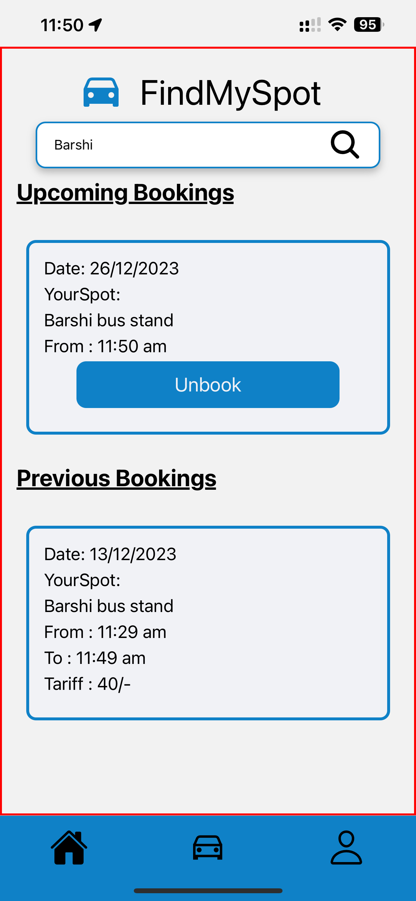
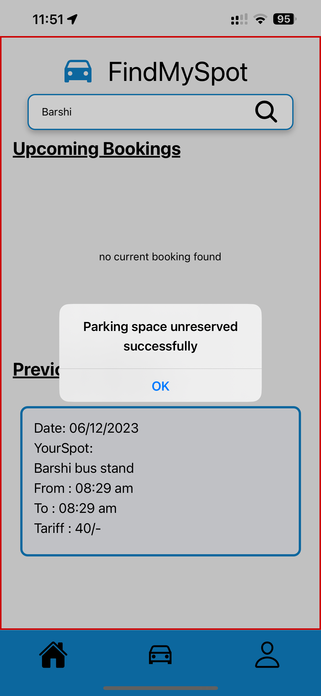

# FindMySpot

Welcome to FindMySpot, your go-to solution for navigating the urban parking chaos! This native mobile application, crafted with React Native and Expo, provides a seamless experience for users grappling with parking challenges in bustling cities. Leveraging powerful TomTom Map APIs for geocoding, FindMySpot revolutionizes the way you find and secure parking spaces.

## Key Features

- **Real-time Parking Availability:** FindMySpot offers users the ability to locate and navigate to available parking spaces nearest to their destination in real-time.

- **Intuitive User Interface:** The user-friendly interface ensures a smooth and efficient experience, making parking hassles a thing of the past.

- **TomTom Map APIs Integration:** We harness the robust capabilities of TomTom Map APIs for accurate geocoding, ensuring reliable and up-to-date information.

## How it Works

1. **Search:** Enter your destination, and FindMySpot will display a map with real-time parking availability.

2. **Book and Unbook Parking Spaces:** Seamlessly reserve parking spots based on your preferences, ensuring a hassle-free experience. Easily manage your bookings by reserving a spot when needed and releasing it when plans change, providing flexibility and convenience for your parking needs..

## Screenshots

**Signup**

**Login**

**Home**

**Destination**

**Profile**

**Booking Confirmation**

**Successful Booking**

**Updated Home**

**Successful Unbooking**

## Demo Video

[Watch our demo video](./Screen_preview/FindMySpot_Demo.MP4) to see FindMySpot in action. This screen recording provides a glimpse into the app's features and how it simplifies your parking search.

